# ProjectWebAsp.net
WEB GIỚI THIỆU VỀ NHỮNG ĐỊA ĐIỂM ĂN UỐNG VÀ DU LỊCH TẠI NHA TRANG QUẢN BÁ HÌNH ẢNH THÀNH PHỐ NHA TRANG BỞI NHỮNG ĐỊA ĐIỂM ĂN UỐNG VUI CHƠI LẪN CẢ CON NGƯỜI NHA TRANG   
*Giao Diện Chính Thứ Nhất
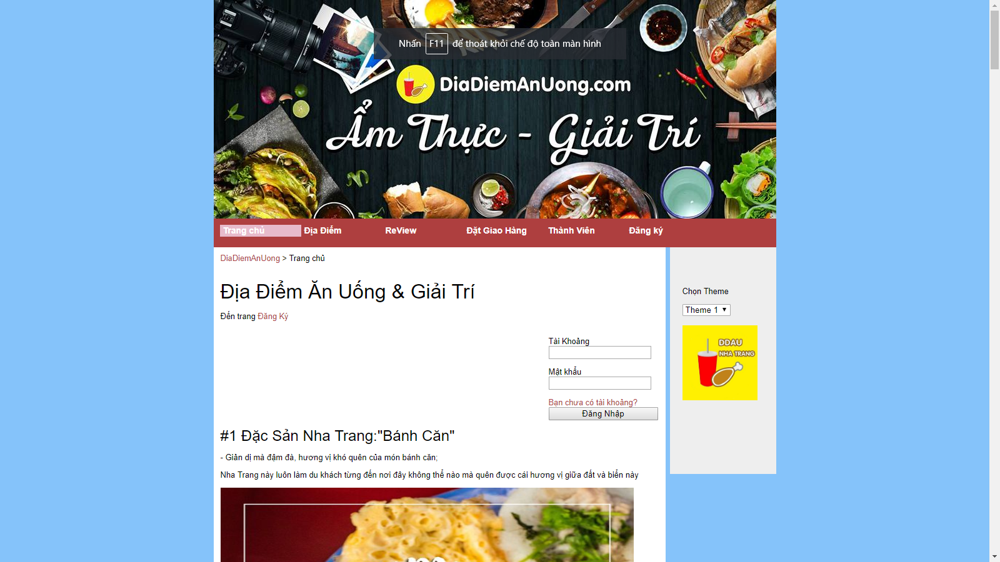
*Giao Diện Chính Thứ Hai
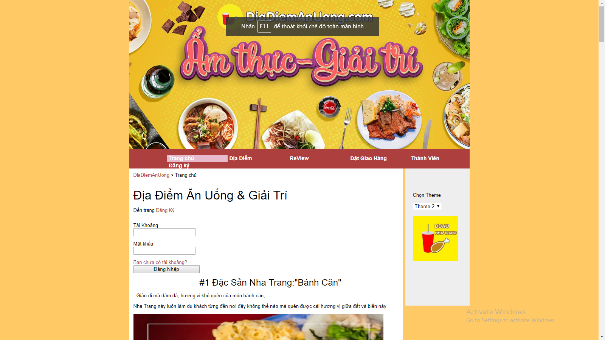
*Đăng Ký Tài Khoản Người Dùng Thành Công  
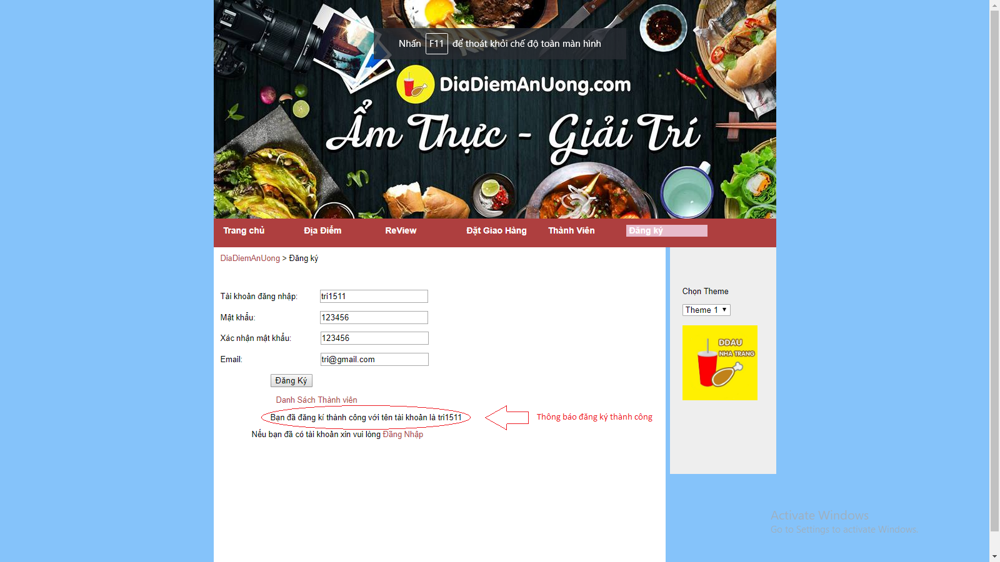
*Đăng Ký Tài Khoản Thất Bại Khi Thiếu Thông Tin
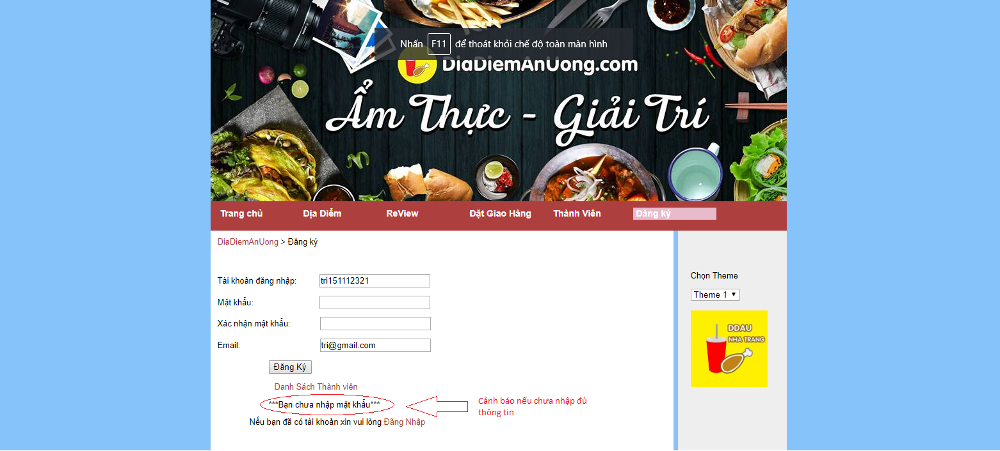
*Dữ Liệu Thành Viên Trong Cộng Đồng Gồm: -Bảng Đầu Tiên Là Danh Sách Thành Viên 
    -Bảng Thứ Hai là Thông Tin Từng Thành Viên
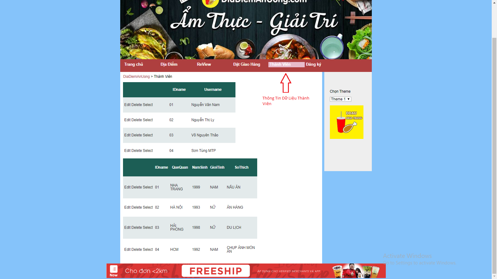
*Contact Giao Lưu Trao Đổi
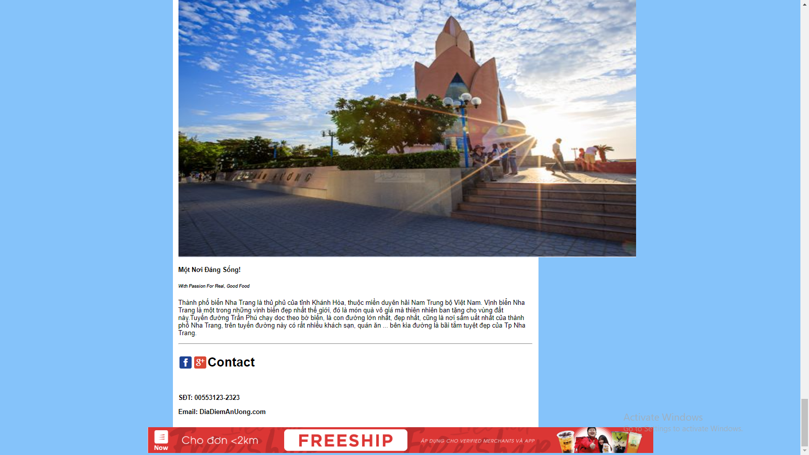
*Món Ăn Đặc Sản Nha Trang
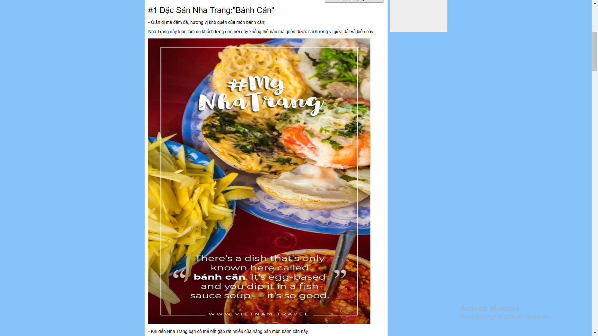
*Top Những Quán CAFFEE Đẹp Tại NhaTrang
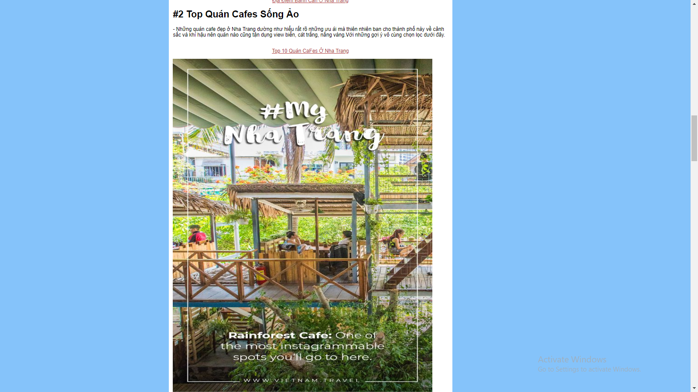
*Đến Nha Trang Thì Ở Đâu?
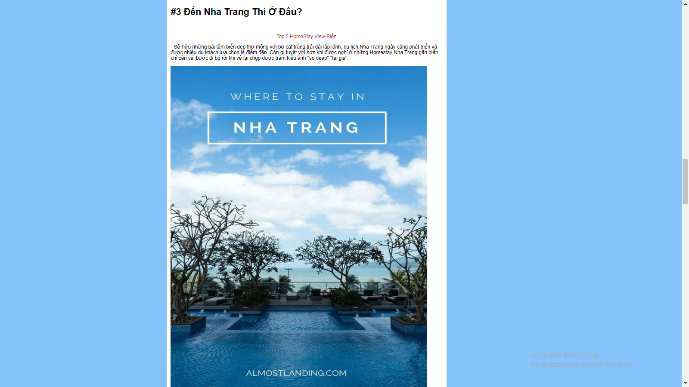
*Địa Điểm Nổi Tiếng Khi Đến Ở Nha Trang Mà Không Được Bỏ Lỡ VINPEARL
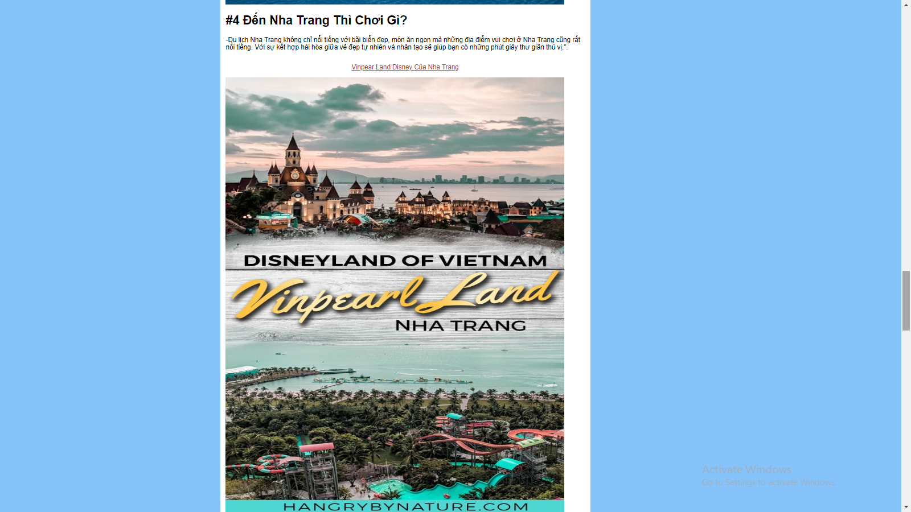
*Con Người Hiền Hòa Ở Nha Trang
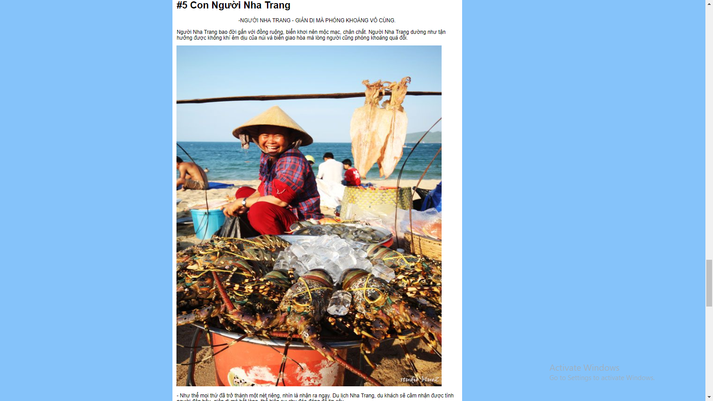

